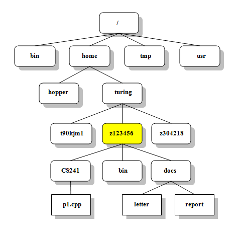
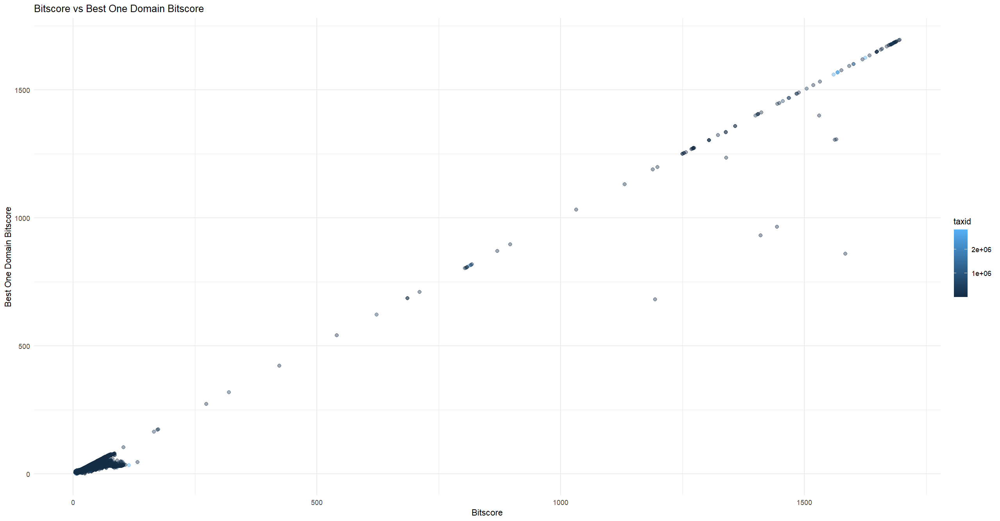
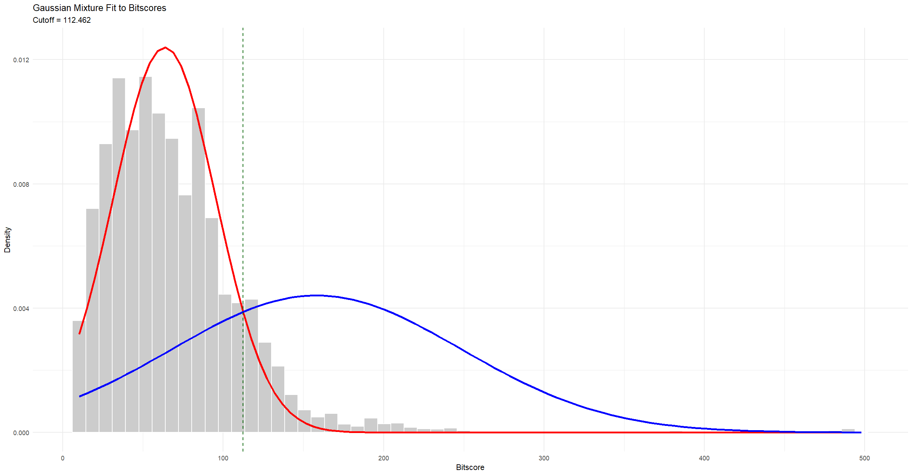

## Table of Contents
* [How to Use This Guide](#how-to-use-this-guide)
* [Quick Tutorial on Unix Commands](#quick-tutorial-on-unix-commands)
* [Initial Setup](#Initial-Setup)
  * [Linux](#Linux)
  * [Virtual Machine](#Virtual-Machine)
  * [Unix Virtual Machine Setup](#unix-virtual-machine-setup)
  * [Cluster](#Cluster)
  * [Local Install Linux](#Local-Installation-of-Linux)
  * [Mac](#mac)
  * [R Studio](#r-studio)
* [Getting Started](#Getting-Started)
  * [Retrieving Proteomic Data](#retrieving-proteomic-data)
  * [HMM Data](#hmm-data)
  * [HMMER Basic Usage](#hmmer-command-line-usage)
* [Advanced Usage](#advanced-usage)
    * [Scripting](#scripting)
    * [Attaching Additional Information](#attaching-additional-information)
    * [Making Custom HMMs](#making-custom-hmms)
* [Data Cleanup](#data-cleanup)
    * [Read in Data and Basic Visuals](#read-in-data-and-basic-visuals)
    * [Another Cutoff Method](#another-cutoff-method)
    * [Taxonomy Addition and Further Cleanup](#taxonomy-addition-and-further-cleanup)


* [GitHub and Multi-Platform](#)


## How to Use This Guide
This guide is intended to be used by students coming into the Powers Lab who are going to be using the HMMER program by S.R. Eddy to run large scale analyses on differing components of the TORC Pathways. This guide assumes a few things going forward: That the students have had some experience with command line syntax and usage, that they have had some programming experience, preferably in python, and that have experience in troubleshooting technical issues in regarding computers or computational like situations. This guide also assumes that students and other users are willing to use search engines such as google/safari/mozilla to search for solutions to common or uncommon problems. Should students not have as much experience, especially with unix command line, a quick tutorial section is written before the initial setup and some "cheat sheets" for command lines are provided. While this quick tutorial section cannot make up for classes that teach the fundamentals of unix command line and provide ample practice opportunity, it can provide a jumping off point for further self work.

## Quick Tutorial on Unix Commands
Lets quickly go over some basics of unix to get somewhat familiar with using the system. What we call Unix is actually more akin to a "Unix Like System" as the original Unix was from the 1970s. We call it a Unix Like System as it uses a lot of the same syntax and organizational structure as the original system. To start with Unix, we are going to need an environment that has it. For MAC and Linux, this is fairly easy as this is simply the command line or the terminal for those operating systems. For Windows its a bit more complicated. This tutorial describes how to get a Linux/Unix like environment further down below.

To start, lets begin with the fundamentals. When you use the command line, everything is divided into directories. You would know these as "folders" in modern parlance. When you open up a terminal, you either start in your home directory or in the directory you opened the terminal in. To change directories, you enter in the following command:

```
cd /path/to/desired/directory
```
cd stands for "change directory" while the "/" marks denote the "level" of the directory you wish to go to. An example image of what is meant by this is shown below:



This image is retrieved from [here](https://faculty.cs.niu.edu/~mcmahon/CS241/Notes/Unix_Reference/file_structure.html). (Need to add a citation here)

Now in order to quickly go to your home directory, you can either type:
```
cd 
```

or:

```
cd ~
```
Both of these will take you to your home directory. In addition, you can also use the following additional commands with cd:

```
cd ..
```
This moves you one level "up" (relative to the tree which is inverted). So if you were at something like /path/foo/bar this would move you to /path/foo/. 

Now lets go over some directory commands to help us orient ourselves. We already went over "cd" so lets make a list of the other commands of use:

First we have "ls":
```
ls
```
This command is probably the single most useful command in Unix as it lists out all of the files in the current directory or in a specified directory:

```
ls /path/to/directory
```

We can further modify our ls command by attaching arguments to it. The most useful ones are presented here:

```
ls -l
```
Which stands for long listing and provides all of the details about the directories and files within.
```
ls -F
```
Which gives the extensions and types of files/directories.


Another useful command when navigating directories  is "pwd":
```
pwd
```
This command will display the current directory you are in. This is very handy when having to figure out how to go back to the directory you are in or if you need to copy and save it for some other usage.

Next, we have "mkdir":

```
mkdir
```
This will make a new directory with the "parent" either your current directory or if specified another directory like so:

```
mkdir /path/to/new/directory
```

We then have "rmdir":
```
rmdir
```
This will remove the directory either connected to your current directory or the directory provided a path:

```
rmdir /path/to/directory
```
By default, this will not remove a directory with files in it. To do so (at your own risk), use the following command which will remove both the files and the directory:

```
rm -rf /path/to/directory
```
Once again, use this command with extreme caution as once it commits it is irreversible.

Going foward, lets talk about creating files and viewing files in the unix environment. To create a file, the "touch" command is used. An example of creating an empty file is shown below:

```
touch /path/to/directory/with/file/file.txt
```
where by giving the path you can create an empty file(of whatever type) at the specified directory.
To view a file, you have a few options. To view the entirety of the file, you can use the "less" command like so:

```
less filename
```
This will prompt you into a new screen viewing the contents of the file you chose. You can scroll through it using the arrow keys or the mouse-wheel and you exit by hitting "q" on your keyboard.

To view the first 10 rows of a file, you would use "head":

```
head filename
```
You can change this to have more or less rows by adding in a -n to the command:
```
head -n 20 filename
```

To view the last 10 files, you use the command "tail" in a similar manner to the "head" command:
```
tail filename
```

```
tail -n 20 filename
```

This is as far as we will go for Unix commands in this tutorial. As such, this is not comprehensive in any meaningful manner. But, it should provide a basis for which further self-exploration of Unix commands can be accomplished as most Unix commands follow a very similar syntax formula and involve mainly files and directories. Not covered in this tutorial include the multiple different commands for searching through files and searching directories. For that, please consult this useful "cheat sheet" that has a wealth of information attached.

This cheat sheet was retrieved from [here](http://barc.wi.mit.edu/education/bioinfo/pages/scripts/unix_cheat_sheet.html). Some additional resources can be found [here]() and [here](https://thejacksonlaboratory.github.io/introduction-to-hpc/cheatsheet/) as well. I would highly recommend spending some time looking over these documents to see the wealth of additional commands that could be used in the future with Unix. 

## Initial Setup

### Linux

In order to successully perform a HMMER analysis run, we first have to make sure we are in the correct environment in order to run it. HMMER runs. For that we are going to need a command line environment, typically a UNIX environment. As such, access to Linux is a definite must. MAC could also be used in a pinch but Linux is preferred.

There are a few ways to obtain and use linux. For most users here at the Powers lab, the two primary methods are either accessing it through our partition at the HPC cluster or via a local virtual instance on a personal machine. This of course assumes that you are using a Windows Based machine. If you are using a Mac, then skip ahead to the section labeled **Mac Users**.

### Virtual Machine

In order to get started with a virtual machine, first you have to download a disc image or .iso image that contains the linux distribution that you want. There are many linux distributions out there due to its open-source nature so if you have prior experience with one, you can use that instead of what will be recommended here. As long as it has a Unix command terminal, it will work.

For this tutorial, we will be using **Ubuntu** as it is the most well known and popular linux distribution or distro. You can grab the files [here](https://ubuntu.com/download/desktop). Simply grab the most up to date version and then click download.

Now that we have a disk image, we need way to use it. This is where a virtual machine comes in. Like its name implies, a virtual machine acts like a modern computer, with all the features, in a virtual fashion while keeping your main computer running. In short, its like running a computer within your computer.

**Oracle VirtualBox** is the virtual machine program of choice. It has a relatively straight forward installation process and it has a wide variety of options. Plus, it allows for multiple different iso images. You can download it [here](https://www.virtualbox.org/)

This tutorial explains how to install and setup the virtual box with disk iso further on in the set-up section.

### Unix Virtual Machine Setup

Once you have the disk image (otherwise known as an .iso file) and you have virtual box, install virtual box onto your machine. Follow the onscreen instructions to install. The default settings will work just fine for the wide majority of cases. Once it is installed, open up the program. You should see something like this:

.png>)


The only difference between this and what you will see is the lack of a virtual machine in the list. Go ahead and click on the new button. From there it should look something like the following:

.png>)
Ensure that you know where you downloaded the iso image and have it available. Give the VM a name and a directory or folder in which it will preside. Everything else should auto populate once you select the iso you downloaded. Then, select the next arrow titled "Set up unattened guest OS installation". It should look like the following:

.png>)
Go ahead and give yourself a username and password. Remember these as they will be needed to access the machine. Also select the "Install Guest Additions" as we will be using that in the future.

Select the next arrow down:

.png>)
Here is where you will allocate system resources to the virtual machine. For a typical installation, having around 4-6 cores/CPUs and around 8GB of RAM (8192 mb) is more than enough. Remember that you are sharing resources with your current machine so assign resources accordingly. The last step is to assign storage space to the machine. The setting default is good but I suggest increasing this. I personally use 100GB but this may be extreme for most use cases. Below is an example of how to set up the storage:

.png>)
You can safely ignore most of the other options in this section. Once you are done, click finish and the program will set up the virtual machine. Once done, it will show up in the list. To start it, select it and then click the start button (green arrow).

Once it loads up, it will do its installation steps for the operating system and then it will prompt you to enter in your username (that you created) and password (that you also created).

Now that we have gotten our virtual machine up and running and have an account, there are a few more things we need to do before we are fully operational. The first thing we need to do is check if our user has what is called "sudo" or root access. We need to do this to be able to change things within our unix setup. 

Run the following command in the terminal:

```sudo -v```

If this prompts you to enter a password, enter the password that you created during setup here. If it succeeds, congrats you have sudo access! If it doesn't, well a little more work will need to be done.

If the password failed, try running this command:

```sudo usermod -aG sudo $USER```

Where $USER is your user name. This should successfully add you to the sudo group.

Now we need to set up a shared folder between the virtual machine and your primary machine. This is a little more involved but fairly straightforward.  First you need to establish a folder that will be used on your primary computer. Then you need to tell virtual box that the folder will be a shared folder. To do so, select the virtual machine from the list and select settings -> shared folders. Find the folder you want and select it using the "add folder button" on the side of the dialogue box. A screenshot is provided below:

.png>)
Once that is done, go back to your running virutal machine. Click on the 'devices' menu and select 'Install Guest Additions CD Image....'. Follow any dialogue box steps that appear. Once done, enter in the following commands within the terminal once those steps are done:

```usermod -aG vboxsf $USER```

Restart the virtual machine and then run the remaining commands on the terminal:

```cd /media/username/VBOX_GAs*```
```sudo sh VBoxLinuxAdditions.run```

Replace username/$USER with your username that you created during setup. If you want to further, you can add on a shared clipboard to copy paste between your primary and the virtual machine. The option is in the same device menu as mentioned prior.

Once we have all the guest additions and the user permissions, it is time to install miniconda and bioconda/conda-forge on your virtual machine. Thankfully, it is very straightfoward and simple process. Open up your terminal and be in your home directory. Enter in the following command:

```curl -O https://repo.anaconda.com/miniconda/Miniconda3-latest-Linux-x86_64.sh```

This downloads the files for miniconda.

```bash ~/Miniconda3-latest-Linux-x86_64.sh```
This runs the bash file (.sh) that you just downloaded.  Follow the prompts to ensure proper installation.

Once done, you should see that your terminal now has a (base) indicator in the front of the line. If this is showing, the next steps are to install bioconda and conda forge. To install biconda and conda forge, enter the following:

```conda config --add channels bioconda```

```conda config --add channels conda-forge```

```conda config --set channel_priority strict```

Follow the terminal prompts and installation should be straightforward.

### Cluster
In this lab, we collaborate with the Korf Lab in order to have a partition on the Hive HPC that UC-Davis provides. The HPC or High-Performance-Cluster is a Cluster computer that contains significant amount of computational resources for research computing. Individual labs get partitions for it in order to run their computational experiments and to store their data. In order to access our partition, a few steps must be accomplished.

First, you must get access to the our cluster partition. To do so, go to this website called [hippo](https://hippo.ucdavis.edu/clusters) and select the Hive Cluster. From there, select a sponsor (Ian Korf) and send in a request once you have created an account. This may take a couple of days to get completed so patience is required here. Once you have confirmed an account, its time to access the Cluster. To do so, go to this [website](https://ondemand.hive.hpc.ucdavis.edu/pun/sys/dashboard) and log in to your account (UC-Davis Account) from there, you should be greeted by the following screen:

.png>)

To access the cluster, click on the Hive Desktop Icon. This will then ask you to generate a session for the partition. An example image is provided to help explain the options available on session creation:

.png>)

In order, we first want to make sure we are on the ikorfgrp account as that is our partition on the cluster. We then want to select the high partition. This is essentially a priority list for the cluster partition. (Go over this in detail here). From here, we then select the number of cpu cores we are going to be using. Typically 8 is more than enough for most processes barring massive experiments. There is a limit to how many cores are available for the parition so only use what you think you need overall. Next we choose the amount of memory or RAM that we are going to need for our session. Same rule applies here: only use what you think you will need. After that we have the option to choose a number of GPUs. Unless we are working on some ML based approaches or other "AI" systems, we can safely leave this blank or 0. And finally, we need to say how many hours we are going to need this parition. Since we are on a shared computational resource, the hour selection is to ensure that when we are done with our work that the resources we were using are then made available to other users.

Once the website says our partition is ready, go ahead and launch the partition. It should open up a new webpage and you will be greeted by the following:

.png>)

As you can see, the partition looks just like a desktop. While we are almost done, there are still a few more steps we need to do in order to get our system set up.

First, we need to access our .bash_profile. This file, kept hidden, controls specific startup scripts that are initiated. We are going to modify this profile. To modify the file, type in the following while in your home directory:

```
vi ~/.bash_profile
```

This will open up the vi editor and enable you to modify the profile. It should be empty.
Modify the script with the following:

```
source $HOME/init/etc/profile
```
This command tells your unix to source or load the profile file in the specified directory. I'd recommend making this directory or something you can find easily. We will modify it in a bit.


```
module load conda
```
This command will ensure that the conda module (installed on the cluster) is always active whenever you log on. Once you modify and save the file, restart the terminal. if (base) shows up next to the command line, conda is being loaded at start.


 Now lets create the profile file. This file contains all of the "aliases" and other needed things necessary to make future usage of unix more streamlined and accessible. After you create the directory (as mentioned in the .bash_profile), go ahead and make the profile file.  I've given an example of a profile file down below provided by the Korf Lab that has suited my needs:

```
alias ls="ls -F"
alias ll="ls -lh"
alias lst="ls -lrth"
alias cls="clear; ls"
alias ..="cd .."
alias gs="git status"
alias ga="git add"
alias gp="git commit -m up; git push"
alias time=/usr/bin/time

PATH=$PATH:$HOME/bin:$HOME/Code/bin
export PYTHONPATH=$PYTHONPATH:$HOME/lib:$HOME/Code/lib
export PERL5LIB=$PERL5LIB:$HOME/lib:$HOME/Code/lib
```

 Most of these aliases are just shortcuts for longer commands. For instance, ls changes the usage ls command to include the file information while doing the command. You can add your own aliases as time goes on to suit your own individual requirements. It should be pointed out that there are aliases regarding git. These will be discussed in detail at a later point.


### Local Installation of Linux

In addition to creating virtual instances of Linux, it is entirely possible to do a local installation of Linux on your machine. While there are some benefits to doing this, mainly having the ability to prioritize system resources, there are risks involved, especially if you don't install properly. These risks range from corrupting data to total loss of your original operating system. If you wish to do this, here are the general steps:

*   First, get a disk image of the linux distribution of your choice. Save it to a portable drive(such as a large usb) and make sure it is "bootable". There are free programs out there that can assist.

*   Second, restart the computer and access the BIOS. Typically done by hitting F12 or F2 or Del during load up repeatedly. At your BIOS, set the set the boot drive to instead be the portable drive containing the linux distribution. This is known as setting the primary drive.

*   Third, restart the computer and follow the onscreen instructions to install linux. When you get to the partition step, choose the option that allows for dual-booting. Often this is called "installing alongside". Once complete, remove the portable drive when prompted and restart the computer. You should be set up to dual-boot between linux and your original operating system.

*   Fourth, set up your linux installation like you would as mentioned in the virtual machine or the cluster. There are numerous online guides to installing linux so google will be your best friend here.

As mentioned prior, do this at your own risk with your primary computer. If you happen to have a spare old computer lying around, using that as a linux machine would be preferable. No loss of needed data and if set up properly another environment to code and engage in research. If you don't have a spare computer, creating a Virtual machine is the vastly superior option as it enables greater flexability and less risk of permanent data loss.


### Mac
If you are using a Mac based computer, you already have a unix terminal installed on your system. This Mac based version of unix is called *Darwin* which makes overall setup pretty easy. The only things you really need to do on a Mac are the following:

To install the developer tools required for getting the packages we use later in this tutorial, use the following command to install:

```
xcode-select --install
```

Furthermore, your home folder may not show up in your sidebar. To change this, go to finder and select settings -> sidebar to add it to the sidebar. This will save you time in the future.


### R Studio
For our future analysis steps of our hmmer data, we are also going to need the R programming language and R-Studio for writing code in the R language. The reason for this is visualization ease. In our analysis, a large amount of data is going to have to be represented in a visual form. In prior experience, I have found that the R-language is uniquely situated in its ability to rapidly and relatively easily create complex visualizations of large data sets. This is especially true with the ggplot library and its associated spin-offs.

To start, you are going to need to install R. You can either install this on your own computer or on the virtual machine or wherever else. You can find R at this [link](https://www.r-project.org/). Follow the onscreen instructions and mind what directory/folder you save it to. You will need to know where it is later on.

 Another nicety of R is R-studio itself. It is a very self-contained system that allows you to run scripts within itself, allowing it to run on a variety of different operating systems with little to no changes needed. You can find R-studio at this [link](https://posit.co/download/rstudio-desktop/). Again, follow the onscreen prompts and installtion is fairly straightforward as long as you know where you saved your R version. As an added bonus, R-studio can also run Python scripts and make markdown documents with proper set-up.


## Getting Started


### Retrieving Proteomic Data

Before we can begin using HMMER, we need to have data to work with per the programs requirements. To start, we are going to need fasta files containing protein information (or whole proteomes for that matter). There are many different databases with the required information out there. The two big ones that are often used in this lab are [NCBI](https://www.ncbi.nlm.nih.gov/protein/) and [Uniprot](https://www.uniprot.org/). The finer details about how to use these databases I'll leave up to the user but in general it is fairly straightforward to download the fasta information from these sources. And as a reminder, a fasta file is essentially a text file that is formatted in a specific fashion. An example is provided below showing the human RAPTOR protein:

```
>ENSP00000513305.1_H_sapiens pep chromosome:GRCh38:17:80544838:80966368:1 gene:ENSG00000141564.16 transcript:ENST00000697423.1 gene_biotype:protein_coding transcript_biotype:protein_coding gene_symbol:RPTOR description:regulatory associated protein of MTOR complex 1 [Source:HGNC Symbol;Acc:HGNC:30287]
MEVLERLLPRTPPPPPPLMESEMLQSPLLGLGEEDEADLTDWNLPLAFMKKRHCEKIEGSKSLAQSWRMKDR
MKTVSVALVLCLNVGVDPPDVVKTTPCARLECWIDPLSMGPQKALETIGANLQKQYENWQPRARYKQSLDPT
VDEVKKLCTSLRRNAKEERVLFHYNGHGVPRPTVNGEVWVFNKNYTQYIPLSIYDLQTWMGSPSIFVYDCSN
AGLIVKSFKQFALQREQELEVAAINPNHPLAQMPLPPSMKNCIQLAACEATELLPMIPDLPADLFTSCLTTP
IKIALRWFCMQKCVSLVPGVTLDLIEKIPGRLNDRRTPLGELNWIFTAITDTIAWNVLPRDLFQKLFRQDLL
VASLFRNFLLAERIMRSYNCTPVSSPRLPPTYMHAMWQAWDLAVDICLSQLPTIIEEGTAFRHSPFFAEQLT
AFQVWLTMGVENRNPPEQLPIVLQVLLSQVHRLRALDLLGRFLDLGPWAVSLALSVGIFPYVLKLLQSSARE
LRPLLVFIWAKILAVDSSCQADLVKDNGHKYFLSVLADPYMPAEHRTMTAFILAVIVNSYHTGQEACLQGNL
IAICLEQLNDPHPLLRQWVAICLGRIWQNFDSARWCGVRDSAHEKLYSLLSDPIPEVRCAAVFALGTFVGNS
AERTDHSTTIDHNVAMMLAQLVSDGSPMVRKELVVALSHLVVQYESNFCTVALQFIEEEKNYALPSPATTEG
GSLTPVRDSPCTPRLRSVSSYGNIRAVATARSLNKSLQNLSLTEESGGAVAFSPGNLSTSSSASSTLGSPEN
EEHILSFETIDKMRRASSYSSLNSLIGVSFNSVYTQIWRVLLHLAADPYPEVSDVAMKVLNSIAYKATVNAR
PQRVLDTSSLTQSAPASPTNKGVHIHQAGGSPPASSTSSSSLTNDVAKQPVSRDLPSGRPGTTGPAGAQYTP
HSHQFPRTRKMFDKGPEQTADDADDAAGHKSFISATVQTGFCDWSARYFAQPVMKIPEEHDLESQIRKEREW
RFLRNSRVRRQAQQVIQKGITRLDDQIFLNRNPGVPSVVKFHPFTPCIAVADKDSICFWDWEKGEKLDYFHN
GNPRYTRVTAMEYLNGQDCSLLLTATDDGAIRVWKNFADLEKNPEMVTAWQGLSDMLPTTRGAGMVVDWEQE
TGLLMSSGDVRIVRIWDTDREMKVQDIPTGADSCVTSLSCDSHRSLIVAGLGDGSIRVYDRRMALSECRVMT
YREHTAWVVKASLQKRPDGHIVSVSVNGDVRIFDPRMPESVNVLQIVKGLTALDIHPQADLIACGSVNQFTA
IYNSSGELINNIKYYDGFMGQRVGAISCLAFHPHWPHLAVGSNDYYISVYSVEKRVR
```

The ">" character denotes to a program the beginning of the header of the file containing the relevant information about the protein or nucleotide of interest. The rest of the file is simply the amino acid or nucleotide sequence. Notice that the sequence letters only go a certain distance before beginning a new line. That is to further help programs read in the information in a standardized manner.

Now while you can download the protein information from these sources quite easily (same as downloading most other things really), it is a bit tedious when having to download a very large amount of information. Thankfully, most databases have specific methods for retrieving bulk data from their servers. We will use NCBI as a case example as that database has the most amount of options available for usage in either command line or scripting.

Since we are using NCBI, we are going to need some of their tools and a way to specify what we want to download. Lets begin with how to specify what we want to download. With NCBI, every single item within their database has an identifier number. For geonomes/proteomes, this is known as an *assembly accession number*. For individual proteins, this is known as an *accession* number, either of RefSeq or GenBank source. For species taxonomy, it's known as a *TaxID*. As such we have a variety of options in which to tell the NCBI tools what exactly we want to pull from their server. We are going to use the *assembly accession number* for an example. Since it is good practice, we will go ahead and create a new conda environment for our tools we will be using. To do so, we enter the following command:

```conda create --name myenv```

Where myenv is the name of the environment you want to create. Since we are going to be using a few tools, lets call the environment "analysis" or something similar just to indicate what the environment is for.

Activate the environment by entering in the command below, substituting $envname for "analysis" or whatever you chose.

```conda activate $envname```

 As an aside, if you ever want to know or forget the environments you have in conda, you can enter the following command(s) to get a list:

```conda info --envs```

```conda env list```

Now we are going to need to get some of the tools that NCBI has built. The most straightforward tool is called **NCBI Datasets**. This tool is designed to retrieve information from the NCBI servers in a command line friendly fashion. A link to the GitHub page is posted [here](https://github.com/ncbi/datasets).

Since we have set up an environment and are in it due to the commands above, go ahead and install the tool, use the following command.:

```
conda install conda-forge::ncbi-datasets-cli
```

Now lets see an example of using this program to download some data. Below I've taken the example command from there GitHub:

```
datasets download genome taxon human --reference --filename human-reference.zip
```
First part of this is the program we are using, datasets. Next we are telling it to download a genome. We are specifying the taxon as human. You could also use the TaxID number here as well. next we are telling the program that we want the reference genome of this organism. We then finally tell the program that we are saving the filename as human-reference.zip, a compressed packaged file. When executing this command, the program will find the information requested and save the compressed file to the current directory. We then need to unzip the file by using the following:

```
unzip human-reference.zip
```

Now lets re-write this to download all of the proteomes for a given taxon. I've elected to download the proteomes for Alveolata as a test case. To do so, we enter the following command:

```
datasets download genome taxon 33630 --include protein --assembly-source genbank --filename alveolata-proteomes.zip | unzip alveolata-proteomes.zip
```
This downloads all the proteomes (as indicated by --include protein) from the taxon 33630 which corresponds to the supergroup Alveolata. The program will only download the proteomes from the genbank group.  The "|" indicates that after the first command is done, I then run a second command to unzip the newly created file.

Before we move on, lets install another program that contains a built in method for obtaining ncbi data. The BLAST program from NCBI contains an additional supporting program called Entrez Programming Utilities or E-Utilities. While we will not be going over usage of this program in much detail here, there are numerous tutorials that exist regarding how to use it. I'll link one here for future [reference](https://bioinformatics.cvr.ac.uk/ncbi-entrez-direct-unix-e-utilities/).  Regardless, it is also a good idea for any bioinformatics analysis environment to have BLAST installed.

```
conda install bioconda::blast
```

### HMM Data
Once we have the fasta data, we need an HMM file to run HMMER with. Before we go further, lets quickly discuss what an hmm file even is. An hmm file or a .hmm file stands for "Hidden Markov Model" file. Within the file is, essentially, a large statistical matrix that enables the hmmer program to "look" for important alignment information. An example of an .hmm file is provided below. We will go over it.

```
HMMER3/f [3.1b2 | February 2015]
NAME  PTHR12848.orig.30.pir
LENG  1278
ALPH  amino
RF    no
MM    yes
CONS  yes
CS    no
MAP   yes
DATE  Fri Jan 14 15:40:03 2022
NSEQ  158
EFFN  6.340637
CKSUM 4203797190
STATS LOCAL MSV      -13.2404  0.69506
STATS LOCAL VITERBI  -14.4783  0.69506
STATS LOCAL FORWARD   -6.8375  0.69506
HMM          A        C        D        E        F        G        H        I        K        L        M        N        P        Q        R        S        T        V        W        Y   
            m->m     m->i     m->d     i->m     i->i     d->m     d->d
  COMPO   2.55163  4.11843  2.90774  2.71333  3.35137  2.91057  3.64213  2.98618  2.73483  2.44913  3.75627  3.04000  3.07787  3.02505  2.89321  2.45843  2.79898  2.79582  4.40178  3.63248
          2.68688  4.41393  2.77572  2.73184  3.46196  2.40630  3.72212  3.29262  2.67813  2.69424  4.24034  2.90370  2.73799  3.18092  2.89825  2.38008  2.77572  2.98521  4.57453  3.61277
          0.13780  2.68827  2.80136  3.77466  0.02321  0.00000        *
      1   5.24476  6.56393  6.33225  6.25866  5.28464  5.52499  6.69670  4.75656  6.08420  3.85960  0.08191  6.34682  6.13454  6.38852  6.04832  5.61581  5.66665  4.90030  6.99205  5.95194     63 M - - -
          2.68826  4.36786  2.78010  2.73924  3.45762  2.41666  3.70412  3.28931  2.68833  2.69306  4.19628  2.90660  2.74013  3.17752  2.89862  2.38042  2.77786  2.98556  4.52641  3.60079
          1.87075  0.55331  1.30583  4.22355  0.01475  0.73837  0.64988
      2   2.90482  5.14548  2.57640  2.50411  4.50645  3.50174  2.90557  3.81920  2.40520  3.45734  4.07820  2.58735  2.52932  2.94563  2.82993  2.00693  2.53929  3.59898  5.44960  4.29873    344 s - - -
          2.68618  4.42225  2.77519  2.73123  3.46354  2.40513  3.72494  3.29354  2.67741  2.69355  4.24690  2.90347  2.73739  3.18146  2.89801  2.37887  2.77519  2.98518  4.58477  3.61503
          0.14461  5.17978  2.04789  0.61958  0.77255  1.18901  0.36316
      3   2.67833  5.09527  3.34335  2.50553  3.06369  3.35173  3.87674  3.40063  2.67197  2.48830  3.88369  2.26297  3.87599  2.84667  2.91007  1.95338  3.15539  3.01087  5.60379  3.68640    345 s - - -
          2.68618  4.42225  2.77519  2.73123  3.46354  2.40513  3.72494  3.29354  2.67741  2.69355  4.24690  2.90347  2.73739  3.18146  2.89801  2.37887  2.77519  2.98518  4.58477  3.61503
          0.00914  5.09600  5.81834  0.61958  0.77255  1.51550  0.24807
      4   2.74595  5.08298  2.35203  2.50895  3.28894  2.92696  3.93002  3.42432  2.68015  2.25000  2.86206  3.16867  3.84716  3.13231  2.60580  2.53830  3.14299  2.86185  5.59396  4.19886    346 l - - -
          2.68618  4.42225  2.77519  2.73123  3.46354  2.40513  3.72494  3.29354  2.67741  2.69355  4.24690  2.90347  2.73739  3.18146  2.89801  2.37887  2.77519  2.98518  4.58477  3.61503
          0.04373  5.09600  3.30599  0.61958  0.77255  1.35185  0.29943
      5   2.37314  4.70719  3.74262  2.73392  2.39448  3.72741  4.14419  2.97549  3.02658  1.79166  3.80770  3.35487  3.21757  3.26179  2.99005  2.48220  2.96319  2.98512  3.78651  4.03896    347 l - - -
          2.68618  4.42225  2.77519  2.73123  3.46354  2.40513  3.72494  3.29354  2.67741  2.69355  4.24690  2.90347  2.73739  3.18146  2.89801  2.37887  2.77519  2.98518  4.58477  3.61503
          0.01990  5.09755  4.29852  0.61958  0.77255  1.41904  0.27700
      6   2.27659  5.29256  2.95586  2.51124  2.79583  3.10947  3.91542  3.72599  2.60587  2.94537  4.34802  2.52820  3.82412  2.46158  2.68706  2.56859  2.55537  3.40029  4.57934  4.06756    348 a - - -
          2.68618  4.42225  2.77519  2.73123  3.46354  2.40513  3.72494  3.29354  2.67741  2.69355  4.24690  2.90347  2.73739  3.18146  2.89801  2.37887  2.77519  2.98518  4.58477  3.61503
          0.00904  5.10655  5.82890  0.61958  0.77255  1.32326  0.30961
      7   2.27018  5.33182  3.22174  1.95927  4.16186  3.26790  3.92681  3.70238  2.53452  2.70282  3.89255  2.81168  3.75356  2.87594  2.82138  2.03516  2.89225  3.08849  5.79348  4.41255    349 e - - -
          2.68618  4.42225  2.77519  2.73123  3.46354  2.40513  3.72494  3.29354  2.67741  2.69355  4.24690  2.90347  2.73739  3.18146  2.89801  2.37887  2.77519  2.98518  4.58477  3.61503
          0.00870  5.14460  5.86694  0.61958  0.77255  1.28932  0.32222
      8   2.78422  5.46167  2.51894  2.15814  4.80568  3.41280  3.46194  3.90872  2.45574  3.21099  4.00735  2.68950  2.59904  2.83818  2.78852  1.85681  3.05174  3.85174  5.89499  4.48467    350 s - - -
          2.68618  4.42225  2.77519  2.73123  3.46354  2.40513  3.72494  3.29354  2.67741  2.69355  4.24690  2.90347  2.73739  3.18146  2.89801  2.37887  2.77519  2.98518  4.58477  3.61503
          0.02703  5.17886  3.86160  0.61958  0.77255  1.41485  0.27834

```
Lets start from the beginning. First, the .hmm file contains relevant information about the file. Things such as the average length, the number of sequences used to make the file, date of creation, etc etc. Then we get to the first row of relative information. The first row which contains hmm has the amino acid single letter alphabet. Below this it has a series of characters such as m -> m, m -> d, etc. These "strings" stand for the different states that can exist within a hidden markov model. For a quick review of this, please see the wikipedia [page](https://en.wikipedia.org/wiki/Hidden_Markov_model).  

Next, we have a series of numbers underneath the alphabet and the strings. These numbers are inverse-log probabilities. Basically, the lower the number, the much higher the probability whereas the higher the number, the lower the probability. The first "numbered" row is called COMPO. This stands for the composition row which acts as a sort of generalized probability row for comparison sake. Notice that there are three rows associated with COMPO. The first row is the match probabilities. The second row is the insertion probabilities. The third row is the transition state probabilities. So to read the COMPO:

Ala has a match probability of 2.55 and an insertion probability of 2.68 as indicated by position. These are fairly low so likely probabilities. To transition from a match state to a match state as denoted by the first position of the third row is 0.13. This means its extremely likely to stay in a match state. To transition from a match state to an insertion state, the second position of the row, is 2.68. And this continues as you go along.

After the COMPO row are the actual positional rows relating to the protein itself that all contain the same three rows with positional probabilities. This goes for as long as the protein is which in this case is 1278 amino acids. So when the hmmer program goes through the sequences,it finds the sequences that are statistically important. This is then reported in the bitscore and evalue of the final hmmer result.


Now finding hmm files can be rather finicky. In personal experience, the best source for hmm files is through [InterPro](https://www.ebi.ac.uk/interpro/). By searching through their database with a particular protein of interest, you can find links and other sources that contain the .hmm files needed. I'll go through an example via the following images:


.png>)
First, search for a protein of interest. We are choosing RICTOR as a test example. I'm using the Human version since I have it readily available in a fasta format. Wait for the website to find the results. Depending on the size of the protein and the traffic to the website, this can take a little time.

Once its done, click on the results and it should look like the following image.

.png>)

From here we can see a large variety of data. While all of this is interesting and should be looked at further, we are interested in an hmm. There is a large section called families. Since that encompasses the majority of the protein, lets use that as the potential source. Click on the side bar option that says representative families and PANTHER underneath that. Once you click it, follow it to the corresponding collaborative database ID link. You should go to this page:

.png>)

Click on the profile hmm section on the left. Then, select download raw hmm. This is the hmm file based on the RICTOR family of proteins. Once you have it, send the file to where you are going to be performing the HMMER analysis.

Now before we move on to running HMMER, I want to make a brief note. It is entirely possible to create your own .hmm files using HMMERs built in programs. We will go into detail as to the requirements for it in the advanced section of this tutorial.


### HMMER Command Line Usage
Now that we have set up a conda environment, we need to install the hmmer program itself for our future analysis. To install the hmmer program suite,  enter the following command:

```conda install bioconda::hmmer```

This will install the hmmer program suite to your current environment.

HMMER as a program suite has a large amount of different programs built within it. It can do things such as searching, hmm file creation, etc. The full list of programs can be found in the hmmer [manual](http://eddylab.org/software/hmmer/Userguide.pdf). For now, we are going to run a very basic example.

To start, we are going to need a fasta file with proteins information. In the tutorial images, we will be using the human proteome as our protein sequence source. Further, we are going to need an hmm file for our analysis. For our purposes, we will be an hmm based on the RICTOR protein. We will discuss how to generate and/or find hmm files in a later section.

Now that we have both an fasta file (proteome) and an hmm file, we are ready to run a hmmer search. The basic implementation of the command is the following:

```hmmsearch <hmmfile> <sequences>```

Running this will run the hmmsearch program with the specified hmmfile and the given sequence. It will send its output to "standard output" or the screen. Its output would look like this:

Should you want to direct its output, you simply add in an additional command:

```hmmsearch -o <file_name> <hmmfile> <sequences>```

There are a lot more potential options that the hmmsearch program can emply. To view the whole list, add a -h (for help) to the command like so:

```hmmsearch -h```

This will give an output detailing all of the different options available as well as a generalized use guide for the program. Here is an example of the help output:

```#
# HMMER 3.4 (Aug 2023); http://hmmer.org/
# Copyright (C) 2023 Howard Hughes Medical Institute.
# Freely distributed under the BSD open source license.
# - - - - - - - - - - - - - - - - - - - - - - - - - - - - - - - - - - - -
Usage: hmmsearch [options] <hmmfile> <seqdb>

Basic options:
  -h : show brief help on version and usage

Options directing output:
  -o <f>           : direct output to file <f>, not stdout
  -A <f>           : save multiple alignment of all hits to file <f>
  --tblout <f>     : save parseable table of per-sequence hits to file <f>
  --domtblout <f>  : save parseable table of per-domain hits to file <f>
  --pfamtblout <f> : save table of hits and domains to file, in Pfam format <f>
  --acc            : prefer accessions over names in output
  --noali          : don't output alignments, so output is smaller
  --notextw        : unlimit ASCII text output line width
  --textw <n>      : set max width of ASCII text output lines  [120]  (n>=120)

Options controlling reporting thresholds:
  -E <x>     : report sequences <= this E-value threshold in output  [10.0]  (x>0)
  -T <x>     : report sequences >= this score threshold in output
  --domE <x> : report domains <= this E-value threshold in output  [10.0]  (x>0)
  --domT <x> : report domains >= this score cutoff in output

Options controlling inclusion (significance) thresholds:
  --incE <x>    : consider sequences <= this E-value threshold as significant
  --incT <x>    : consider sequences >= this score threshold as significant
  --incdomE <x> : consider domains <= this E-value threshold as significant
  --incdomT <x> : consider domains >= this score threshold as significant

Options controlling model-specific thresholding:
  --cut_ga : use profile's GA gathering cutoffs to set all thresholding
  --cut_nc : use profile's NC noise cutoffs to set all thresholding
  --cut_tc : use profile's TC trusted cutoffs to set all thresholding

Options controlling acceleration heuristics:
  --max    : Turn all heuristic filters off (less speed, more power)
  --F1 <x> : Stage 1 (MSV) threshold: promote hits w/ P <= F1  [0.02]
  --F2 <x> : Stage 2 (Vit) threshold: promote hits w/ P <= F2  [1e-3]
  --F3 <x> : Stage 3 (Fwd) threshold: promote hits w/ P <= F3  [1e-5]
  --nobias : turn off composition bias filter

Other expert options:
  --nonull2     : turn off biased composition score corrections
  -Z <x>        : set # of comparisons done, for E-value calculation
  --domZ <x>    : set # of significant seqs, for domain E-value calculation
  --seed <n>    : set RNG seed to <n> (if 0: one-time arbitrary seed)  [42]
  --tformat <s> : assert target <seqfile> is in format <s>: no autodetection
  --cpu <n>     : number of parallel CPU workers to use for multithreads  [2]
  --stall       : arrest after start: for debugging MPI under gdb
  --mpi         : run as an MPI parallel program 
```

Now lets see what an example of what a HMMER result looks like in the terminal. This was performed on the Human proteome using an hmm that corresponds to the RAPTOR protein used in a prior analysis:


```
# hmmsearch :: search profile(s) against a sequence database
# HMMER 3.4 (Aug 2023); http://hmmer.org/
# Copyright (C) 2023 Howard Hughes Medical Institute.
# Freely distributed under the BSD open source license.
# - - - - - - - - - - - - - - - - - - - - - - - - - - - - - - - - - - - -
# query HMM file:                  HMM/raptor.hmm
# target sequence database:        9606/ncbi_dataset/data/GCF_000001405.40/protein.faa
# - - - - - - - - - - - - - - - - - - - - - - - - - - - - - - - - - - - -

Query:       PTHR12848.orig.30.pir  [M=1278]
Scores for complete sequences (score includes all domains):
   --- full sequence ---   --- best 1 domain ---    -#dom-
    E-value  score  bias    E-value  score  bias    exp  N  Sequence       Description
    ------- ------ -----    ------- ------ -----   ---- --  --------       -----------
          0 1684.2   0.1          0 1683.9   0.1    1.0  1  NP_065812.1     regulatory-associated protein of mTOR isoform
          0 1410.4   4.5     1e-278  931.1   6.2    2.0  2  NP_001156506.1  regulatory-associated protein of mTOR isoform
    6.4e-27   97.0   0.0    2.1e-07   32.3   0.0    5.6  4  NP_001034842.2  echinoderm microtubule-associated protein-lik
    1.1e-26   96.1   0.0    2.4e-07   32.1   0.0    5.6  4  XP_016859587.1  echinoderm microtubule-associated protein-lik
    1.7e-26   95.6   0.0    1.4e-07   32.9   0.0    5.7  3  XP_047300256.1  echinoderm microtubule-associated protein-lik
    2.8e-26   94.8   0.0    1.1e-06   30.0   0.0    5.1  4  XP_047300255.1  echinoderm microtubule-associated protein-lik
    2.9e-26   94.8   0.0    9.2e-07   30.2   0.0    5.0  4  XP_016859589.1  echinoderm microtubule-associated protein-lik
    1.3e-24   89.3   0.0    1.6e-06   29.4   0.0    6.2  4  XP_016876554.1  echinoderm microtubule-associated protein-lik
    1.5e-24   89.1   0.0    1.4e-06   29.6   0.0    6.2  4  NP_001397962.1  echinoderm microtubule-associated protein-lik
    1.6e-24   89.1   0.0    1.5e-06   29.5   0.0    6.2  4  NP_001372045.1  echinoderm microtubule-associated protein-lik
    1.6e-24   89.0   0.0    1.5e-06   29.4   0.0    6.2  4  NP_899243.1     echinoderm microtubule-associated protein-lik
    2.4e-24   88.4   0.0    4.3e-06   28.0   0.0    5.6  4  XP_047300271.1  echinoderm microtubule-associated protein-lik
    2.9e-24   88.2   0.0    1.5e-06   29.5   0.0    6.2  4  XP_016876551.1  echinoderm microtubule-associated protein-lik
    3.4e-24   87.9   0.0    1.6e-06   29.4   0.0    6.3  4  XP_047287012.1  echinoderm microtubule-associated protein-lik
      6e-24   87.1   0.0    4.7e-06   27.8   0.0    5.4  4  XP_047300258.1  echinoderm microtubule-associated protein-lik
    1.3e-23   86.0   0.0      4e-06   28.0   0.0    5.8  4  XP_047287013.1  echinoderm microtubule-associated protein-lik
    2.3e-23   85.2   0.0    1.4e-06   29.6   0.0    5.3  3  XP_016876555.1  echinoderm microtubule-associated protein-lik
    2.3e-23   85.1   0.0    1.3e-06   29.7   0.0    5.3  3  XP_016876552.1  echinoderm microtubule-associated protein-lik
    2.5e-23   85.0   0.0    1.3e-06   29.7   0.0    5.3  3  XP_011534833.1  echinoderm microtubule-associated protein-lik
    2.6e-23   85.0   0.0    1.5e-06   29.5   0.0    5.3  3  XP_011534832.1  echinoderm microtubule-associated protein-lik
    2.6e-23   85.0   0.0    1.5e-06   29.5   0.0    5.3  3  XP_011534830.1  echinoderm microtubule-associated protein-lik
    4.1e-23   84.3   0.0    1.2e-06   29.7   0.0    5.0  3  XP_011534836.1  echinoderm microtubule-associated protein-lik
    4.1e-23   84.3   0.0    1.2e-06   29.7   0.0    5.0  3  XP_016876558.1  echinoderm microtubule-associated protein-lik
    4.3e-23   84.3   0.0    1.5e-06   29.4   0.0    5.0  3  XP_016876556.1  echinoderm microtubule-associated protein-lik
    5.9e-23   83.8   0.0    1.4e-06   29.5   0.0    5.3  3  XP_011534834.1  echinoderm microtubule-associated protein-lik
    7.9e-23   83.4   1.0    3.2e-21   78.1   1.0    2.0  1  NP_056541.2     DDB1- and CUL4-associated factor 8 [Homo sapi
    1.3e-22   82.7   0.0    1.6e-06   29.4   0.0    5.2  3  XP_016876557.1  echinoderm microtubule-associated protein-lik
    2.3e-22   81.9   0.0    4.7e-06   27.8   0.0    4.8  3  XP_011534835.1  echinoderm microtubule-associated protein-lik
    2.3e-22   81.8   0.0    4.9e-06   27.8   0.0    4.8  3  XP_016876553.1  echinoderm microtubule-associated protein-lik


```

This example is a snapshot of the text format result of the hmmersearch run. The results indicate the following: The first evalue for the specific protein in relationship to the hmm. This evalue is for the entirety of the protein. This is followed by a bitscore of the whole protein along with a bias score. The next evalue and bitscore are for the best single domain found within the query protein. This in turn is followed by another bias score for the single domain. Finally, the results indicate the specific ID of the protein along with any additional information. If this seems a lot like a BLAST output which this tutorial assumes you have some experience with, you wouldn't be wrong in thinking so. HMMER was heavily inspired by BLAST and gives most of the statistics in its results. As such, inferring relevant information from a HMMER result is the same as inferring from a BLAST result.


## Advanced Usage


### Scripting
While running HMMER on the command line is a very powerful tool, it becomes apparent that there are some immediate issues. For instance, how would you run this on a series of proteomes or a series of hmm files that you want to analyze? This is where scripting comes in. When it comes to unix, there is a multitude of different scripting options for running bulk processes. The two main ones that come to mind are either *BASH* or *Python* scripting. Each has its own strengths and weakness along with their own specific syntax. It is much beyond the scope of this tutorial to talk about the syntax of either language so some prior knowledge or some very powerful google skills are necessary going foward. 

BASH scripting is the most like the command line in terms of overall syntax. In fact, most of the commands used in a BASH script are essentially the same for command line. The only major difference is really in the organization of the syntax. For the purposes of this tutorial, an example bash script will be provided that shows the basic idea of iterating through a directory, grabbing the fasta files, and running the hmmsearch program on each of the found fasta files. Hopefully this script will give a good starting example and further independent learning and experimentation can take you further with BASH scripts.

```
#!/user/bin/env bash

# Usage ./hmmsearch.sh /path/to/search_dir /path/to/hmm /path/to/output

SEARCH_DIR="$1"
HMM_FILE=""$2"
OUTDIR="$3"

# Check for the arguments existence
if [[ -z "$SEARCH_DIR" || -z "$HMM_FILE" || -z "$OUTDIR"]]; then
    echo "Usage: $0 <search_dir> <hmm_file> <output_dir>"
    exit 1
fi

# Create the output directory if it doesn't exist

mkdir -p "$OUTDIR"

# Using recursion, find FASTA Files and run hmmsearch

find "$SEARCH_DIR" -type f \( -iname "*.fa" -o -iname "*.fasta" -o -iname "*.faa" -o -iname "*.fna" \) | while read -r fasta; do
    bases=$(basename "$fasta")
    out="$OUTDIR/${base}.tblout"
    
    echo "Running hmmsearch on $base"
    hmmsearch --tblout "$out" "$HMM_FILE" $fasta
done

echo "Done
```

Despite the relatedness to Unix command line, it also is far less readable than python with many "archaic" symbols and sometimes very stringent whitespace controls. This is of course my personal opinion. As such, when creating scripts for running bulk commands in a unix environment, i've often found python to be much more readable and intuitive. 

An example of a script that does the same thing as above is presented here. While the overall script is longer, it is likely much easier to understand in comparison. The script also has the added benefit of taking the hmmer results data and combining it all together into a large csv file:

```
"""
Kyle Johnson
HMMER Run Script
4/8/2026

Purpose of this program is to first read in all the fasta files recursively within a given directory.
The Program then runs the hmmsearch program and stores the results in a temporary file.
Each fasta file is then added to the aforementioned temporary file. 
The temp file is then parsed and converted into a csv file for easier access in further analysis steps.
Only requirement of this program is to have an environment with the hmmsuite programs already installed.
Every other library is included within the default python 3 installation.
"""

# Libraries
import os
import subprocess
import csv
import tempfile
import argparse

def find_fasta_files(root_dir):
    """
    Recursively yield full paths to FASTA files
    """

    for dirpath, _, filenames in os.walk(root_dir):
        for f in filenames:
            if f.lower().endswith((".fa", ".fasta", ".faa", ".fna")):
                yield os.path.join(dirpath, f)


def parse_tblout(tblout_path):
    """
    Yield parsed rows from a HMMER tblout file
    """
    with open(tblout_path, "r") as f:
        for line in f:
            if line.startswith("#"):
                continue
            parts = line.strip().split()
            if len(parts) < 18:
                continue
            yield [
                parts[0], # target name

                parts[1], # accession

                parts[2], # query name

                parts[3], # query accession if available

                parts[4], # e-value

                parts[5], # bit score

                parts[6], # bias

                parts[7], #best domain e-value

                parts[8] # best domain bit score
            ]


def run_hmmer(root_dir, hmm_file, output_csv):

    """ 
    Recursively scans for FASTA files, runs hmmer using temp directories to save on space and
    writes the output to a csv file
    """

    fasta_files = list(find_fasta_files(root_dir))
    print(f"Found {len(fasta_files)} FASTA Files")

    with open(output_csv, "w", newline="") as csvfile:
        writer = csv.writer(csvfile)

        # Establish the header for the csv file
        writer.writerow([
            "query_file",
            "target_name",
            "accession",
            "query_name",
            "query_accession",
            "e_value",
            "bitscore",
            "bias",
            "best_domain_evalue",
            "best_domain_bitscore"
        ])

        for fasta_path in fasta_files:
            fasta_name = os.path.basename(fasta_path)

            with tempfile.TemporaryDirectory() as tmpdir:
                tblout_path = os.path.join(tmpdir, "results.tblout")

                cmd = [
                    "hmmsearch",
                    "--tblout", tblout_path,
                    hmm_file,
                    fasta_path
                ]

                print(f"Running HMMER on {fasta_name}")
                subprocess.run(cmd, check = True)

                # Parse the tblout and write the rows
                for row in parse_tblout(tblout_path):
                    writer.writerow([fasta_name] + row)

    print(f"\nsaved combined CSV file to {output_csv}")


# Now I need to make a main function with argparsing for the input, output, and the hmm file
def main():
    """
    Main function that will take in argparse arguments for the hmmer run
    """
    parser = argparse.ArgumentParser(
        description="Recursive hmmsearch runner with filtering options"
    )
    parser.add_argument("-i", required = True, help = "Input directory of fasta files to be used")
    parser.add_argument("-o", default = "results.csv", help = "Name of output file")
    parser.add_argument("-hmm", required = True, help = "HMM file to be used for the analysis")
    arg = parser.parse_args()


    run_hmmer(
        root_dir= arg.i,
        hmm_file = arg.hmm,
        output_csv= arg.o
    )


if __name__ == '__main__':
    main()
```
From both of these examples, a certain pattern should emerge for our analysis. Our primary goal is to do the following: We want to first read in the fasta files from a directory. Often we want to do this recursively to capture all of the potential fasta files that may exist. We then want to run each fasta file we have collected into the hmmsearch program. Additionally, we can either keep the hmm file we are interested in as a single variable or we can read in hmm files in a similar fashion to the fasta files. Regardless, we have to have the hmm available. We then need to run the hmmsearch program and save combined output of every fasta file we used into one master table. By doing this, we ensure that our future analysis steps are much more streamlined and easy to process.

It should be noted that doing bulk runs of hmmer can take a fair bit of time, depending on the number of proteins being analyzed, the number of hmms being used, and other factors. While it isn't going to take days or weeks, do give yourself some time to run the analysis. Don't do a last minute thing and hope for the best.

### Attaching Additional Information

Now that we have done a hmmer analysis on all of our data, lets take a look at the csv file using the handy "less" command on command line. While the data more than likely looks terrific with potentially some strong results, there is something missing: We don't have a way to tie the specific proteins to the organisms that they came from. This is a result of the way the sequences were read in. So we are going to have to find an alternative way to attach some relevant data to this. We first have to consider what we have within the csv file. One possible option is to use the protein IDs as a "key" for searching for and attaching relevant taxonomic information. Doing this can be a little tricky however. Lets go over a general project workflow to see what we need to do:

1.  Extract out the protein id numbers from the csv
2.  Input the extracted protein ids into some NCBI databases
3.  Using the NCBI database, find the associated taxon ID number
4.  Tie the taxon ID number to our csv file, attaching at the appropriate proteins
7.  Write out the new csv file with the newly attached information

I've gone ahead and written an example script of how to do this using the **Entrez-Direct** program and python **Pandas**. It is posted down below and is available on the lab github.

```

"""
Kyle Johnson
Assisted with code from Microsoft Co-Pilot
4/12/2026

Purpose of this code is to do the following:

Read in a csv file that was created during a hmmersearch run. This requires Pandas
From the csv file and with the known column that contains found target sequences,
send the personal identifiers of the proteins to NCBI using E-utilities (required) on commandline.
This sending of target ids is done in a chunking method to speed up searches.
Once the resulting taxonomic ID numbers associated with the proteins is found, return it and attach it to the loaded in csv data.
Write out a new version of the csv data with the attached taxonomic id information based on user parameters

"""
import pandas as pd 
import subprocess
import argparse
import re 
import time
import os
import sys


# Global Variable
# API Key for NCBI
# Version of this program has this already inputted. 
# Any modifications to your version of this program should use personal API key

os.environ["NCBI_API_KEY"] = "Please paste your NCBI API key here"

# Function call for running a command line program based upon given parameters
def run_cmd(cmd):
	result = subprocess.run(cmd, capture_output = True, text = True)
	if result.returncode != 0:
		print("Command error: ", result.stderr)
		return ""
	return result.stdout

# A loading bar for visual determination of how many proteins or chunks are left out of the total
def progress_bar(current, total, bar_length = 40):
	fraction = current / total
	filled = int(fraction * bar_length)
	bar = "#" * filled + "-" * (bar_length - filled)
	sys.stdout.write(f"\rProgress: [{bar}] {current}/{total}")
	sys.stdout.flush()
	if current == total:
		sys.stdout.write("\n")


# Creates a batch out of a list of things based upon a pre-determined size
# This is for sending in batches to NCBI to limit the traffic
def batch_list(items, size):
	"""
	Yield batches of specified size
	"""
	for i in range(0, len(items), size):
		yield items[i:i + size]


# Extracting the taxid information from a genpept text that is retrieved
def extract_taxid(genpept_text):
	match = re.search(r'taxon:(\d+)', genpept_text)
	return match.group(1) if match else None


def main():
	parser = argparse.ArgumentParser()
	parser.add_argument("-input", required = True, help = "Input csv file here")
	parser.add_argument("-col", default = "protein_column", help = "Name of the protein column")
	parser.add_argument("-output", default = "combined_hmmer_assemblies.csv", help = "Give name of new csv file. Default is 'combined_hmmer_assemblies.csv'")
	arg = parser.parse_args()

	# Variables
	df = pd.read_csv(str(arg.input))
	protein_column = str(arg.col)
	taxid_list = []
	delay = .35
	batch_size = 200

	if protein_column not in df.columns:
		raise ValueError(f"Column '{protein_column}' not found in CSV file")

	protein_ids = df[protein_column].astype(str).tolist()
	total_proteins = len(protein_ids)
	processed = 0

	for batch in batch_list(protein_ids, batch_size):

		# Fetch multiple proteins at once
		id_str = ",".join(batch)
		cmd = ["efetch", "-db", "protein", "-id", id_str, "-format", "gp"]
		out = run_cmd(cmd)

		# Split GenPept records
		records = out.split("\nLOCUS")

		# First split produces an empty chunk, skip it
		records = [r for r in records if r.strip()]

		# Map each record to a taxID
		for record in records:
			taxid = extract_taxid(record)
			taxid_list.append(taxid)

			processed += 1
			progress_bar(processed, total_proteins)

		time.sleep(delay)

	df["taxid"] = taxid_list
	df.to_csv(str(arg.output), index = False)
	print(f"Done. Output written to {str(arg.output)}")

if __name__ == '__main__':
	main()
```

Feel free to use this code or modify it as you wish. It should grab the taxid associated with the species that the proteins are derived from. Be sure to have E-utilites installed on your conda environment. You can either do this via bioconda or access this through BLAST as it comes packaged with it. Also be sure to have *Pandas* installed on your environment running this code as it is required for reading in the csv file as a dataframe for manipulation purposes.


### Making Custom HMMs

Another feature of the HMMER program suite is the creation of hmms proper. In the previous sections of this tutorial, we have been using previously generated hmm files associated with our proteins of interest, whether that be of the protein family or of a specific domain structure. But what about situations where we may not have those readily available or perhaps we have a novel domain we are interested in? That is where the hmmbuild program comes into play. But before we can use it though, we need to make sure we have a few things set up first. We of course are going to need some fasta files of the proteins we are interested in. Assume by this point that these are simply always required. The other thing we are going to need is a multiple sequence alignment of the proteins. In this tutorial, we are going to be using the command line version of an alignment program. You can of course find the alignment programs online but it is often faster to run these locally on our own machines or services. 

Lets begin by looking at some of the programs out there. In this lab, we primarily use two different programs: ClustalOmega and MUSCLE. In general, we tend to use ClustalOmega, now referred to as ClustalO, more frequently than we do MUSCLE. ClustalO has been found to be faster with larger or more sequences than in comparison to MUSCLE while still retaining fairly high accuracy. When we do use MUSCLE, it is primarily when we are doing a very deep analysis of the sequences in question and need an additional verification of the alignment. However, you will find that using both programs is remarkably similar.

Lets start by installing ClustalO on our conda environment. Begin by using the following command to install it from bioconda:

```
conda install bioconda::clustalo
```

Once it is installed, we can find its help options/manual by typing in the following:

```
clustalo -help
```
From the manual, we can see that in order to use the following command to align our proteins we give the following command:
```
clustalo -i <raw_protein_fasta_here> -o <name_of_new_alignment> --threads=<number> --verbose
```
Breaking down the command, first we give the program our raw fasta protein data to be aligned. We then give it a name, denote the number of threads from the cpu we are giving (there is a default of 4) and then tell the program to be "verbose" or to tell us what exactly it is doing during runtime.

Lets also go ahead and install MUSCLE using a very similar bioconda command:
```
conda install bioconda::muscle
```
With the muscle program, the help manual is really not much help here. So lets go to the website and see an example usage case. You can find the link to it [here](https://www.drive5.com/muscle5/manual/getting_started.html). Apologies in advance for the website as it is stuck in the 90s.

As we can see from the website, a typical command looks something like the following:
```
muscle -align sequences_of_interest.fasta -output alignment_name.fasta
```

As you can see, its very similar to ClustalO, just with some slightly different syntax. There are of course more commands and options for both of these programs but I'll leave that to self-exploration on a case by case basis for the time being.

Now, we probably want to take a visual look at the MSA file we just generated. You could take a look at the file itself in its fasta format. While it is technically legible and you can get information from it, its not really human accessible in this format. What we need is a visualization program or tool to use. One of the most well used ones and used within this lab is [JalView](https://www.jalview.org/download/). This program is designed to read in multiple sequence alignments and then present them in a human readable format with different visualization options. I'd highly recommend downloading this program either for your main operating system or linux and using it to check on your alignments. It is assumed that readers of this tutorial have at least some understanding of what constitutes a good alignment so we will not go over the details here. In another tutorial we will go in length about MSAs and what makes a good alignment and how to interpret.

So assuming at this point we have a MSA file that we are confident in the results of, lets go ahead and run the hmmbuild program to generate the hmm file that we want.

First, ensure that we have hmmer installed or we are in an environment that has hmmer installed. Lets look at the hmmbuild manual that comes standard with the hmm program suite:

```
hmmbuild -h
```

As you can see, there are quite a variety of options. For the most part, running the hmmbuild program is fairly automatic and we can safely use the basic options here. A basic example usage case of hmmbuild program is shown here:

```
hmmbuild [options] <hmm_file_output> <msa_input>
```
For most use cases, this basic command will cover our needs for generating a hmmfile for the sequences we want. It should also be noted that, in general, we want at *least* 50 sequences in our multiple sequence alignment for generating an hmm file. More of course is always preferred but 50 is our minimum. This is to ensure some level of statistical accuracy for the hmm that is meaningful for further analysis.


## Data Cleanup
Once we hopefully have a csv table filled with our HMMER results that have taxonomic id numbers associated, we need to do some data cleanup in order to remove potential false positives and other extraneous bits of data. While it is completely possible to clean up the data using Unix commands on the csv file, I wouldn't really recommend it. For one, the commands for cleaning the data are much harder to use and frankly its really unintuitive. Second, the risk of accidently modifying the "raw" data rather than making a copy of the data that has been cleaned is much higher. As such, I much rather prefer reading in the data either in the R language or Python. For our purposes, we are going to use R as it has some advantages when it comes to reading in tables.

### Read in Data and Basic Visuals

First and foremost we are going to prep our R script. Open up R studio and create a new blank file/script. First we are going to need to activate the "tidyverse" library. This library is a suite of different functions and objects that are designed for streamlined data-cleanup. We first need to ensure the library is loaded and then initalized

```
install.packages("tidyverse")

library(tidyverse)
```

We can then source the page or run each line individually. Now lets read in the data, provided you know the location of the data (you can either have this in linux or download the data once its complete). Here is the R-code for reading in the data with tidyverse:

```
hmmer_data <- read_csv(file = "path/to/csv_hmmer_data.csv", col_names = TRUE)
```

This assigns the hmmer_data variable the information, a dataframe, from a csv file. It also keeps the column names when it reads it in. Now that we have the data, lets take a look at it. In R-studio you can either click on the variable in the table on the right hand side of the screen or you can do the following command:

```
hmmer_data %>% view()
```
The %>% is a pipe operator. This is expected to be read as "and then do this". So this command is saying take the hmmer_data dataframe and then use the view() function on it.

One thing we need to notice in our data is we have a lot of possible answers but probably not great answers. This is likely due to a variety of things ranging from shared domains to just small segements of sequence similarity. Since we know that sequence defines shape which define function of proteins, its important for us to be absolutely sure of our results. Since we have potentially some very high numbers, we could do a variety of things. We could create some cut-off value and ignore everything below it or we could simply grab the maximum of the proteins. Of course we want to do this for each taxonomic ID as we are interested for the proteins within the organisms.

In order to do this, lets first group the data. Lets first take our data and then using the pipe operator, group the data according to the taxonomic id number. The code should look something like this:

```
hmmerdata %>% group_by("column_with_taxonomic_id_number")
```

Now we have a grouped set of data. Lets go ahead and filter it two different ways as discussed before. We will do one version that is based on a filter and another that is based on the maximum value:

```
maximum_hmmer_data <- hmmerdata %>%
  group_by("column_with_taxonomic_id_number) %>%
  filter(bitscore_column == max(bitscore_column, na.rm = TRUE)) %>%
  ungroup()
```

This command will first group the data (like we did before) and then it will filter the data with the bitscore column becoming whatever is the maximum value found within that column, replacing any empty values within the column. Once it has done this, it will ungroup everything (a cleanup step going forward). Finally, the results of this will be saved to a new variable called maximum_hmmer_data, keeping our original data intact while having the filtered data available to play around with.

Now lets do a numeric filter instead. The process is essentially the same, except this time we are replacing the max value with a defined value. The code to it is shown below:

```
filtered_hmmer_data <- hmmerdata %>%
    group_by(column_with_taxid) %>%
    filter(bitscore_column == filter_value) %>%
    ungroup()
```

 To determine the best filter or "cut-off value", there are a few methods we could employ. The simplest method is a visual analysis followed by some random sample blast searches. To do the visual analysis, lets add in a new library to the analysis: ggplot2

 ggplot2 which stands for "grammar of graphics plot" is a library that is designed to make a streamlined R syntax for quickly generating visualization plots of many different types. First lets get it installed and the library loaded:

 ```
install.packages("ggplot2")
library(ggplot2)
 ```
Lets then decide what our X and Y axis are going to be for the plot. It would stand to reason that we probably want to use our overall bitscore to denote one axis and the best one domain bitscore for the other. One says how well the overall alignment was and the other denotes the best single domain in said alignment. If both are high, then its a likely match. If one is lower than the other, then there is something going on that needs to be addressed.

Lets begin by using ggplot2. First we have to pipe in the dataframe to the ggplot function

```
hmmer_data %>% ggplot()
```

Then we need to define the "aesthetics" of the ggplot, basically what is the x axis, the y axis, colors, fill, etc:

```
hmmer_data %>% ggplot(aes(x = bitscore, y = best_domain_bitscore, color = taxid, fill = taxid))
```

I've gone ahead and created it so that the aesthetics will be x for bitscore, y for the domain bitscore, and the color and fill are going to be the taxid to determine which is which protein.

Since we are dealing with the "grammar of graphics", we need to add in some graphics to this. Lets add in a dot plot. We add in elements or grammar to the ggplot by using "+"

```
hmmer_data %>% ggplot(aes(x = bitscore, y = best_domain_bitscore, color = taxid, fill = taxid)) +
    geom_point()+
    labs(title = "Bitscore vs Best Domain Score",
        x = "Bitscore",
        y = "Best Domain Score",
        color = "red"
    )+
    theme_minimal()
```
So in order, first we take the dataframe object (hmmer_data) and pipe it into ggplot. Once we set up the aesthetics, we then tell ggplot to add in a geom_point (points on a graph) to the plot. We then further add in some labels and then we set a theme for the background and other such things. When you run this on your data, it should generate an output something like this:



As you can see, we have a large concentration of points closer to the 0 score. We probably don't want those. We also have a few outliers that are lower in one domain vs the other. Those are a potential investigation source. Next step would be to redo some of the filters to select for the major "low" group and then take some samples and BLAST. I'd reccomend using the NCBI webversion since we are just doing a QA check. First take the taget name (ID) and retrieve the fasta for it. This can be done [here](https://www.ncbi.nlm.nih.gov/protein/?term=). Once you do that, BLAST the results using the link [here](https://blast.ncbi.nlm.nih.gov/Blast.cgi?PROGRAM=blastp&PAGE_TYPE=BlastSearch&LINK_LOC=blasthome).

Once you have done these steps and made a record of the random samples, you will find that a good cutoff value is somewhere around 100 to 150 in this particular case. From there, it is relatively simple on how to filter out hits that we don't want:

```
filtered_data_random_sample <- hmmer_data %>% filter(bitscore > random_sample_cutoff_variable)
```


### Another Cutoff Method
While the random sample method is a fairly easy method, it does have some flaws. It requires additional out of R steps to validate and the picking random proteins is potential a problem with reproducability. In addition, there is much more required in terms of "judgement calls". 

In order to address this, other potential methods do exist to help make an informed decision on a potential cutoff value. One such method is a *Gaussian Mixture Model*. In short, this is a probabilitis model that assumes data points are generated from a mixture of several gaussian(or normal) distributions with unknown parameters. Basically, this model assigns clusters to a batch of data that we can then use to help gauge what is a good cutoff value.

First we are going to need another library to help with this type of analysis.

Start by installing and then activating the following packages. Two of them should be familiar:

```
install.packages(mclust)
install.packages(tidyverse)
install.packages(ggplot2)

library("mclust")
library("tidyverse")
library("ggplot2")
```
Now lets begin creating the variables and dataframes for this analysis.

First we want to pull the bitscores from our data and then generate a "Mclust" with the data:

```
mix <- hmmer_data %>%
    drop_na(bitscore) %>%
    pull(bitscore) %>%
    Mclust(G = 2)
```
In order, we are taking the hmmer_data, ignoring any NA values, pulling just the bitscore column, and then using that data to input into the Mclust function with a G (for number of clusters we are considering) set to 2. We then save this to mix.

Next, we need to establish some parameters based on what we just generated:

```
params <- tibble(
    component = c("low","high"),
    mean = mix$parameters$mean,
    sd = sqrt(mix$parameters$variance$sigmasq)
)
```

Here we are creating a tibble (dataframe) that has a component section of either high or low, a mean calculated from values within the mix object, and a standard deviation calculated from stored values in mix.

We then need to make a value for our calculated cutoff:

```
cutoff <- uniroot(
    f = function(x){
        dnorm(x, params$mean[1], params$sd[1]) -
        dnorm(x, params$mean[2], params$sd[2])
    },
    interval = range(df$bitscore, na.rm = TRUE)
)$root
```

Okay this one requires a little more breaking down. This is known as a root finding approach for computing the intersection point of two gaussian curves. The idea is this is exactly where the two mixture components have equal "density" and we can call a bitscore cutoff

We want to find the value of x where the density(1)(x) = density(2)(x).

For Gaussian, this means dnorm(x; mean1, standard deviation1) = dnorm(x; mean2, standard deviation2). 

Again, we are trying to find x and where the F(x) = 0. This is where the two equations are equal, implying that the intersection point is the optimal cutoff according to his model.

Now we just need to draw the plot with all of this data collected:

```
    df %>%
      ggplot(aes(bitscore)) +
      geom_histogram(aes(y = after_stat(density)),
                     bins = 60, fill = "grey80", color = "white")+
      stat_function(fun = ~dnorm(.x, params$mean[1], params$sd[1]),
                    color = "red", size = 1.2)+
      stat_function(fun = ~dnorm(.x, params$mean[2], params$sd[2]),
                    color = "blue", size = 1.2)+
      geom_vline(xintercept = cutoff, color = "darkgreen", linetype = "dashed")+
      labs(title = "Gaussian Mixture Fit to Bitscores",
           subtitle = paste("Cutoff =", round(cutoff, 3)),
           x = "Bitscore", y = "Density")+
      theme_minimal()
```
Breaking down the code, first we read in the dataframe, establish a ggplot object with aes set to bitscore. We then create a histogram within ggplot that uses density from after_stat (a specific function that provides stats). We go on to create a stat function that draws the first gaussian curve and then the second gaussian curve. Finally, we add in a line that denotes the cutoff value we calculated earlier and we add in some titles for information sake.

All in All the graph will look something like this when completed:



As an added bonus, we also have a subtitle in the title that gives us the exact cutoff value we caluclated. We can use that going forward.

All that's left to do is to take that cutoff value and apply it to our data and get a filtered list:

```
filtered <- hmmer_data %>% filter(bitscore > cutoff)
```
I should note that with this method, we are relying on bitscore and bitscore alone. There is no biological information added here. As such, we need to sometimes be cautious with this cutoff. There may be partials that we miss or false positives added. In order to truly rule those out, we would have to compare this data to a reference set. Basically, a set of data in which we know where our cutoff value would be. As such, I'd highly recommend making a small but reliable reference set that you can plot out to visualize and compare with your experimental data.


### Taxonomy Addition and Further Cleanup
Now that we have a cutoff and have cleaned up our data, lets add some more relevant information to it for helping us later on. Some good ideas for this data going forward: making a new column that states that the protein is present or isn't present and attaching taxonomic information to help show greater phylogeny.

Lets start with the first task. This is going to be relatively straightforward as we are simply adding in a column that will say "Yes, I do have this protein after the analysis". While it may seem obvious that the filtered results have the protein, having this column is a useful thing when you are doing comparative analysis with other hmmer data. For instance, perhaps one species has 2 of the proteins you are looking for but the other doesn't? Being able to quickly establish this would be vital, especially further analysis and visualization work.

Lets begin by doing a simple column addition in tidyverse:

```
filtered <- filtered %>% mutate(new_column_name = "Yes")
```
We of course can do it this simply since we have established the presence of the protein by and large.

Lets also do something else to help make our data more distinctive. Let's rename the bitscore column to the name of the protein we are interested. Again, there is a method to the madness here.

```
filtered <- filtered %>% rename(New_bitscore_column_name = "bitscore")
```

Now lets add in taxonomy information. First we are going to have to retrieve said information, likely from a source such as NCBI. There are a few ways to do this. You could submit the taxon IDs from your data set to **NCBI Batch Entrez** in the form of a text file and download the data from there. A link is provided [here](). Alternatively, you could run a python script using E-utilities to download the data also using the taxon ids. While the python script is automated, it does take a lot more work to set up. I've made a script to do this and it is available in the github for use. Please read the about section in the script for running instructions.

For our purposes in this tutorial, we are going to use the script I've generated. First we need to extract out the taxids from our data. This is relatively straightforward:

```
taxonids <- filtered %>% distinct(taxid) %>% select(taxid)
```

We then need to save this as a csv file:

```
write_csv(filtered, file = "path to output/name.csv", col_names = TRUE)
```
Take that file and place it in an environment where you can run a python script. Now we run the script. You will require a few more added program suites to get it working in your environment. Read the description of the program to determine what you will need. It should require Pandas, Entrez, Biopython as a start. It also may take a moment depending on the number of IDs you have to process. This is due to the server based retrieval that is ongoing.

Once you run that, it will generate a csv file that contains the relevant information. Download that information somewhere you can easily access. Go ahead and read back in the data you just downloaded:

```
taxon_data <- read_csv(file = "path/to/download/, col_names = TRUE)
```

Its always good practice to look at the data once you retrieve it. As such, go ahead and view it:

```
taxon_data %>% view()
```
Now we will probably notice that the taxid column is named something different compared to our data. Make sure to rename that as it will be necessary going forward:

```
taxon_data <- taxon_data %>% rename(taxid = "old column taxid name")
```
Lets also make sure that the taxids are distinct. Add in the following code:

```
taxon_data <- taxon_data %>% distinct(taxid)
```

Finally, lets add this data to our filtered data so that we can have a combined set.
Lets also make a new dataframe called combined_data so that we can retain the other dataframes as they are. To do this, we are going to do something called a left join. Here is a graphical representation of joins. While it may look complicated, given enough time, you will notice that it actually isn't that bad. The reason we are doing a left join is that we want to take all of the elements in our filtered data (our left) and then we want to add rows that match to our filtered data via a key (taxid in our case) with new information.

(Need to add a source for this)

To do a left join with our data, you can use the following command:
```
combined_data <- left_join(filtered, taxon_data, by = "taxid")
```

This will add all of the columns from the taxon_data to the filtered data that match up with the taxid. If you want to be more selective with the columns that you want, the following code is a good template:

```
combined_data <- left_join(filtered, taxon_data[c("column1","column2","column3", "taxid")], by = "taxid)
```
Notice that you *must* include the taxid when doing the join. When it comes to it, to attach new rows to a pre-exisiting dataframe, you must have some sort of key in which to anchor onto the data. In our case, that was taxid.

Now by this point, we should have a cleaned dataset with lots of relevant information.

